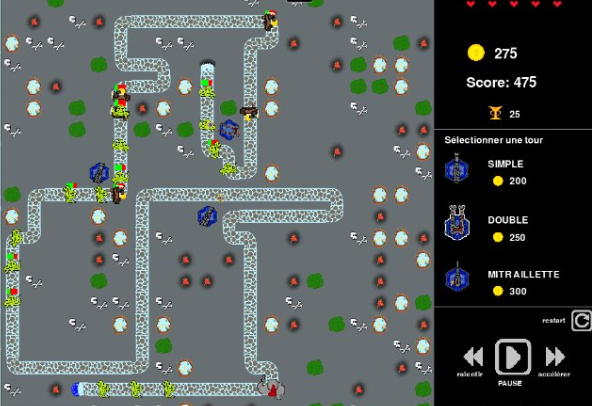
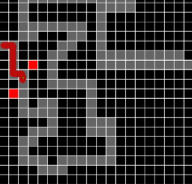

# Tower Defense

## Principe du jeu :  

Notre jeu est un Tower Defense. 

Le but du joueur est d'empêcher ses ennemis d'atteindre la fin de la rivière. Pour cela il peut acheter des tours équipées de canons et les positionner sur la carte (en dehors de la rivière) afin d'éliminer les ennemis arrivant au fur et à mesure depuis le portail bleu. 

Chaque ennemi tué rapporte des pièces au joueur, et lui apporte donc la possiblité d'acheter des tours plus performantes. Il peut également déconstruire des tours dans l'optique de gagner de l'argent et de libérer l'emplacement pour une autre tour.

Chaque ennemi atteignant la fin de la rivière enlève un ou plusieurs points de vie au joueur, qui possède 10 points de vie.

Le score du joueur augmente en fonction du nombre d'ennemis tués.

## Description des fonctionnalités du jeu : 

**Actions du joueur :**

L'utilisateur peut :

- Construire une tour. Pour cela il doit cliquer sur le modèle de tour souhaité puis sur l'emplacement où il souhaite la positionner. Il ne peut pas positionner de tour sur la rivière. Sa bourse est décomptée du prix de la tour (indiqué à côté de celle-ci dans le menu de sélection)

- Déconstruire une tour. Pour cela il doit cliquer sur la tour choisie déjà positionnée sur la carte. Celle-ci disparaît et le joueur est remboursé du prix de base d'une tour (prix indiqué au début du jeu). Il peut à nouveau payer pour construire une tour sur le même emplacement.

- Accélérer ou ralentir le jeu: l'avancée des ennemis et la fréquence de tir des tours.

- Appuyer sur le bouton pause : les tours, les projectiles et les ennemis se figent.

- Appuyer sur le bouton restart : le jeu recommence avec une nouvelle configuration de carte.

- Fermer la fenêtre d'affichage pour quitter le jeu.

Le joueur gagne de l'argent lorsque : 
- une de ses tours tue un ennemi
- il finit une vague d'attaque en avance

**Ennemis :**

Les ennemis se déplacent sur la rivière, en arrivant par vagues. Ils ne peuvent pas s'en éloigner ni attaquer les tours construites sur les berges.

Il existe 3 types d'ennemis : 
- les gobelins, rapides mais possédant peu de points de vie
- les barbares, plus résistants mais moins rapides
- les chevaliers, les plus résistants et les plus lents

**Tours :**

Une fois positionnée par le joueur, une tour tire sur l'ennemi à portée situé au plus proche d'elle.

Il existe 3 types de tour : 
- Les tours simples qui tirent un projectile à la fois avec une portée importante
- Les tours doubles, munies d'un double canon permettant de tirer deux projectiles à la fois sur le même ennemi, faisant d'importants dégats mais avec une cadence de tir réduite.
- Les tours mitraillette qui tirent un projectile plus rapidemment que les tours simples et que les tours doubles.

Le prix des tours augmente en fonction du nombre de tours du même type déjà construites.

## Installation : 

Pour pouvoir jouer au Tower Defense, il faut installer les modules suivant de la bibliothèque Python : 
- pygame
- numpy
- random
- math
- abc

Ensuite il faut clôner le dépôt git et se placer sur la branche Main.

## Démarrage : 

Lancer le programme __init__.py situé dans le dossier Game. 

Une fenêtre CW - TowerDefense s'ouvre : le jeu commence.

## Analyse et répartition des tâches : 

Avant de commencer à coder nous avons listé dans le fichier texte **etapes.txt** (disponible sur le dépôt Git) les différents objets ou fonctionnalités à coder, en les classant selon leur ordre d'importance (essentiels pour le projet minimal ou dans la catégorie améliorations) 

Puis nous avons découpé en étapes la création du projet (d'abord le projet minimal en 13 étapes, puis les améliorations selon leur orde d'importance)

Nous avons alors pu piocher dans les étapes pour se répartir le travail au fur et à mesure de la semaine.

**Choix de conception :**

- Programmation orientée objet

Nous avons choisi d'utiliser la programmation orientée objet pour créer les entités "Tour", "Sprite","Case","Chemins", "OpponentManager","Boutons", etc

Les différents types d'ennemis et les projectiles héritent de la classe "Sprite". Les différents types de tours héritent de la classe "Tour".

Une telle implémentation permet de définir des comportements communs pour les boutons (boutons stop, refresh, sélection des tours,...), les tours, les ennemis et le lancement des vagues d'attaque, tout en laissant la possiblité d'implémenter également des fonctionnements spécifiques par la suite en fonction de leur utilisation.

- Interface graphique

Nous avons utilisé Pygame pour sa maniabilité et sa capacité à jouer des fichiers audio.

## Version minimale : 

Dans la version minimale, un seul type d'ennemi se déplace sur un chemin prédéterminé. Il n'existe qu'un seul type de tour, qui tire sur l'ennemi le plus proche. Les ennemis avancent en continu, et on peut placer autant de tours que l'on veut (pas de limite d'argent)

Les formes utilisées sont géométriques.

Les commits correspondant aux principales améliorations apportées au jeu minimal sont associés de tags : vous pouvez les retrouver dans la catégorie "tags" du dépôt git.

## Idées d'améliorations futures : 

- Possiblité d'ajouter de nouveaux types d'ennemis ou de tours (simple grâce au choix de la programmation orientée objet)
- Possibilité d'améliorer les tours après leur construction
- Adaptation de la fenêtre de jeu à la taille de l'écran (mode plein écran)
- Animations des projectiles et des tirs
- Création de structure annexes (fermes, bunkers, ...) permettant de gagner davantage d'argent ou de regagner des points de vie
- Remodeler la zone de jeu pour avoir une zone de jeu en relief : nouvelles règles possibles en jouant sur l'altitude (ennemis en hauteur inatteignables par les tours par exemple)

## Ressources utilisées : 

Les ressources utilisées pour créer le code et les graphismes sont : 
- Paint
- Paint.net
- VsCode

Les musiques et les bruitages proviennent de https://lasonotheque.org et sont libres de droit.
